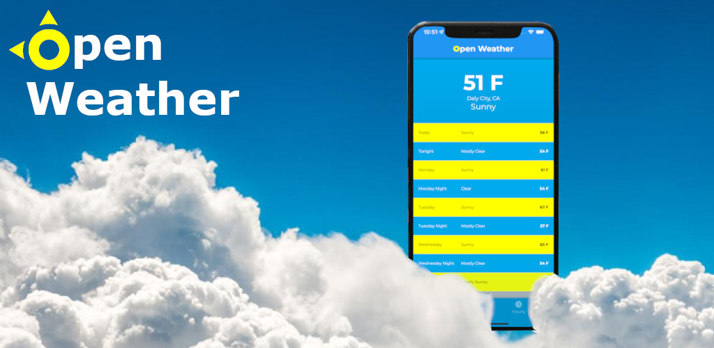

# Open Weather

[iOS Download](https://apps.apple.com/us/app/opened-weather/id1625189315)
[Android Download](https://play.google.com/store/apps/details?id=com.owenbean.openweather)


Open Weather is a simple colorful mobile application that will provide the information on weather at current location.

### About Project

Projected started as a way for Owen Bean to learn the Flutter framework with Dart programming language. Open Weather was a simple app to learn with that includes API calls, UI design, and simple navigation.

### API Call

API link used is https://api.weather.gov/points/*latitude*,*longitude*.
<br> <br>
**https://api.weather.gov/points/latitude,longitude**

```
{
    "properties": {
        "forecast": "Link for weekly forecast",
        "forecastHourly": "Link for hourly forecast"
        "relativeLocation": {
            "properties": {
                "city":
                "state":
            }
        }
    }
}
```

**Weather Information**
{
"temperature": "Temperature"
"temperatureUnit": "Temperature Unit"
"name": "Name of the day"
"shortForecast": "Short description of the weather"
"isDayTime": "Boolean if information is during the day time"
"startTime": "Time the weather prediction starts"
}
